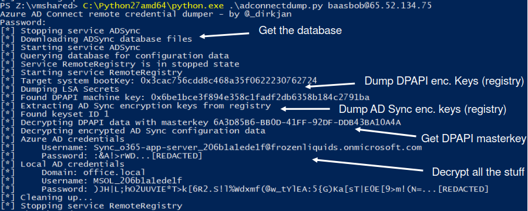

# Azure AD Connect / Entra ID connect credential extraction tools
[](https://dev.azure.com/dirkjanm/adconnectdump/_build/latest?definitionId=16&branchName=master)

This toolkit offers several ways to extract and decrypt stored Entra ID (Azure AD) and Active Directory credentials from Entra ID Connect servers. These credentials have high privileges in both the on-premise directory and the cloud. The tools were originally released as part of my Azure AD presentation at TROOPERS 19. For more info on the technical background you can watch the presentation on [YouTube](https://www.youtube.com/watch?v=JEIR5oGCwdg) or view the slides [here](https://www.slideshare.net/DirkjanMollema/im-in-your-cloud-reading-everyones-email-hacking-azure-ad-via-active-directory).  You can download the latest binaries of this tool [here](https://dev.azure.com/dirkjanm/adconnectdump/_build/latest?definitionId=20&branchName=master) (click on "1 published" in the middle of the page to download the binaries).

Note that the storage method of the credentials was changed in late 2019. The ADSyncDecrypt tool will automatically impersonate the `NT SERVICE\ADSync` service to extract the credentials via DPAPI. ADSyncGather is not compatible with the updated credential storage, but adconnectdump.py/ADSyncQuery should be working. The inner workings of this method are described in [this blog](https://dirkjanm.io/updating-adconnectdump-a-journey-into-dpapi/).

In 2025, Microsoft introduced the option of using a Service Principal identity for Entra ID connect instead of a user account. The tool ADSyncCertDump is compatible with this. The code for this tool is based on [Shwmae by Ceri Coburn](https://github.com/CCob/Shwmae) and used under the BSD-3-Clause license.

# Tool comparison
This repository features 3 different ways of dumping credentials. 
- **ADSyncDecrypt**: Decrypts the credentials fully on the target host. Requires the AD Connect DLLs to be in the PATH. A similar version in PowerShell was released by Adam Chester [on his blog](https://blog.xpnsec.com/azuread-connect-for-redteam/).
- **ADSyncGather**: Queries the credentials and the encryption keys on the target host, decryption is done locally (python). No DLL dependencies.
- **ADSyncQuery**: Queries the credentials from the database that is saved locally. Requires MSSQL LocalDB to be installed. No DLL dependencies. Is called from `adconnectdump.py`, dumps data without executing anything on the Azure AD connect host.
- **ADSyncCertDump**: For Service Principal based setups. Will dump the certificate and private key if it is a software based key, or will sign an assertion to be used with roadtx if the key is TPM stored. Needs to be run on the target host with Administrator privileges.

The following table highlights the differences between the techniques:

Tool | Requires code execution on target | DLL dependencies | Requires MSSQL locally | Requires python locally | Compatible with SP based setup 
--- | --- | --- | --- | --- | ---
ADSyncDecrypt | Yes | Yes | No | No | No
ADSyncGather | Yes | No | No | Yes | No
ADSyncQuery | No (network RPC calls only) | No | Yes | Yes | No
ADSyncCertDump | Yes | No | No | No | Yes

# Usage
## ADSyncDecrypt
Execute as admin on the Azure AD connect host from a location that has the required DLLs (by default AD Connect is installed in `C:\Program Files\Microsoft Azure AD Sync\Bin`). It will give you the configuration XML and the decrypted encrypted configuration.

## ADSyncGather (old configuration only)
Run ADSyncGather.exe on the Azure AD connect host (as Administrator), for example in memory using `execute-assembly`. Save the output to a file and parse it with `decrypt.py`:
```
F:\> decrypt.py .\output.txt utf-16-le
Azure AD credentials
        Username: Sync_o365-app-server_206b1a1ede1f@frozenliquids.onmicrosoft.com
        Password: :&A!>rWD...[REDACTED]
Local AD credentials
        Domain: office.local
        Username: MSOL_206b1a1ede1f
        Password: )JH|L;hO2UUVIE*T>k[6R2.S!l%Wdxmf(@w_tYlEA:5{G)Ka[sT|E0E[9>m!(N=...[REDACTED]
```

## ADSyncQuery / adconnectdump.py
You should call `adconnectdump.py` from Windows. It will dump the Azure AD connect credentials over the network similar to secretsdump.py (you also will need to have [impacket](https://github.com/SecureAuthCorp/impacket) and `pycryptodomex` installed to run this). ADSyncQuery.exe should be in the same directory as it will be used to parse the database that is downloaded (this requires MSSQL LocalDB installed on your host).



Alternatively you can run the tool on any OS, wait for it to download the DB and error out, then copy the mdf and ldf files to your Windows machine with MSSQL, run `ADSyncQuery.exe c:\absolute\path\to\ADSync.mdf > out.txt` and use this `out.txt` on your the system which can reach the Azure AD connect host with `--existing-db` and `--from-file out.txt` to do the rest.

## ADSyncCertDump
The ADSyncCertDump tool is for extracting the credentials or assertion of the Service Principal used for Entra ID connect in modern setups. If such a setup is in use, instead of providing you with credentials, ADSyncDecrypt will provide you with a _client id_ and a _certificate thumbprint_. These parameters can be provided to ADSyncCertDump and it will extract the certificate and private key if they are stored as software keys. If stored as hardware keys, it will create an assertion that you can use with _roadtx appauth_ (see the [roadtx wiki](https://github.com/dirkjanm/ROADtools/wiki/ROADtools-Token-eXchange-\(roadtx\)) for details).

```
Usage: ADSyncCertDump.exe <cert thumbprint> <client_id> <tenant_id>
```
